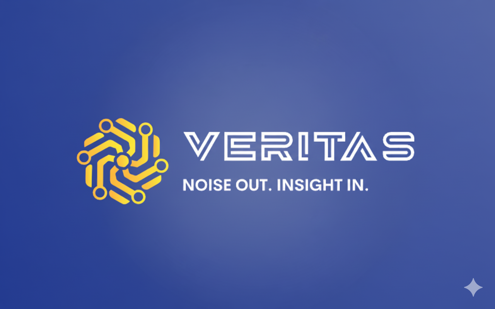
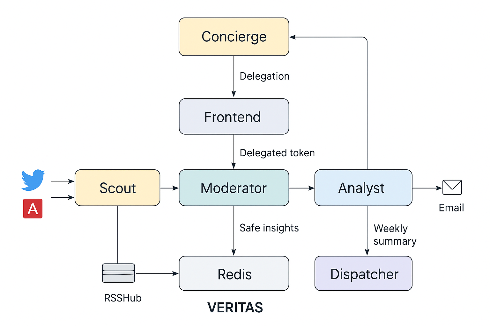

# Project-Veritas
<p align="center">
  
</p>

<h1 align="center">🕵️ Project VERITAS</h1>
<p align="center"><i>🔎 Truth in Feeds. Insight in Action.</i></p>

---

<p align="center">
  
</p>

<p align="center">
  
  
  
  
  
</p>

---

## 🌟 What is Veritas?

**Veritas** is a distributed system that filters, moderates, and analyzes content from **Twitter** and **arXiv** feeds.  
It ensures only **relevant and safe insights** reach the user by combining **auth delegation, moderation, and AI-driven analysis**.  

Veritas also delivers **weekly summaries directly to your email inbox 📧**, keeping you updated with key insights.

---

## 🏗️ Architecture

Here’s how Veritas works under the hood:  



---

## 🛠️ Services Overview

| Service       | Port  | Role                          | Tech Stack            |
|---------------|-------|-------------------------------|-----------------------|
| **Concierge** | 8080  | Auth delegation (Descope)     | FastAPI + Descope SDK |
| **Scout**     | 8001  | Feed ingestion (Arxiv/Twitter)| FastAPI + SQLite + Redis + RSSHub |
| **Moderator** | 8002  | AI-based content moderation   | FastAPI + Groq LLM    |
| **Analyst**   | 8003  | AI insights & summaries       | FastAPI + Groq LLM    |
| **Dispatcher**| 8004  | Weekly digest email delivery  | FastAPI + SMTP/Email  |
| **Frontend**  | 5173  | React-based user interface    | React + Vite + Descope React SDK |
| **Redis**     | 6379  | Queue + caching               | Redis                 |
| **RSSHub**    | 1200  | Twitter/Feed proxy            | Node.js (RSSHub)      |

---

## ⚡ Quick Start


```bash
1️⃣ **Clone the Repository**
git clone https://github.com/Aryan-2511/Project-Veritas.git
cd Project-Veritas

2️⃣ Set up Environment Variables
Fill in your .env with:

Descope project ID + keys

Redis URL

SMTP credentials (for weekly digest emails)

3️⃣ Run with Docker Compose

docker-compose up --build
```

✅ All services (Concierge, Scout, Moderator, Analyst, Dispatcher, Frontend, Redis, RSSHub) start together via Docker Compose.

---

## 🎨 Frontend Demo

    Login with Descope → Authenticate securely

    Subscribe to Arxiv/Twitter feeds → Choose topics or handles

    Automatic Moderation → Unsafe content blocked by Moderator

    View Insights → Analyst summarizes key points

    Weekly Digest → Dispatcher sends email with highlights
---

## 💡 Why Veritas?

        🛡️ Trusted Feeds → Filters spam & unsafe content

        🤖 AI Moderation → Content passes through LLM for validation

        📊 Actionable Insights → Analyst extracts summaries & key points

        📧 Email Digest → Weekly insights straight to your inbox

        🔑 Secure by Design → Descope delegated tokens for scoped access
---

## 📌 Roadmap
        ✔️ Core services (Concierge, Scout, Moderator, Analyst, Dispatcher)

        ✔️ Descope-based delegated authentication

        ✔️ Feed subscriptions (Twitter, Arxiv)

        ✔️ AI moderation + insights pipeline

        ✔️ Weekly digest emails

        ⏳ Enhanced dashboard for subscriptions & insights

        ⏳ Advanced moderation categories (toxicity, misinformation, bias)


 
---

## 🤝 Contributing

        Contributions are welcome! 🎉  
        If you’d like to add new features or suggest improvements, feel free to open an issue or PR.

---

## 👨‍💻 Author

Made with ❤️ by **Aryan**  

- 🌐 GitHub: [Aryan-2511](https://github.com/Aryan-2511)  
- 🤗 Hugging Face: [Aryan-2511](https://huggingface.co/Aryan-2511)  

---

✨ With VERITAS, you don’t just read the news…
You read the truth. 🔎
